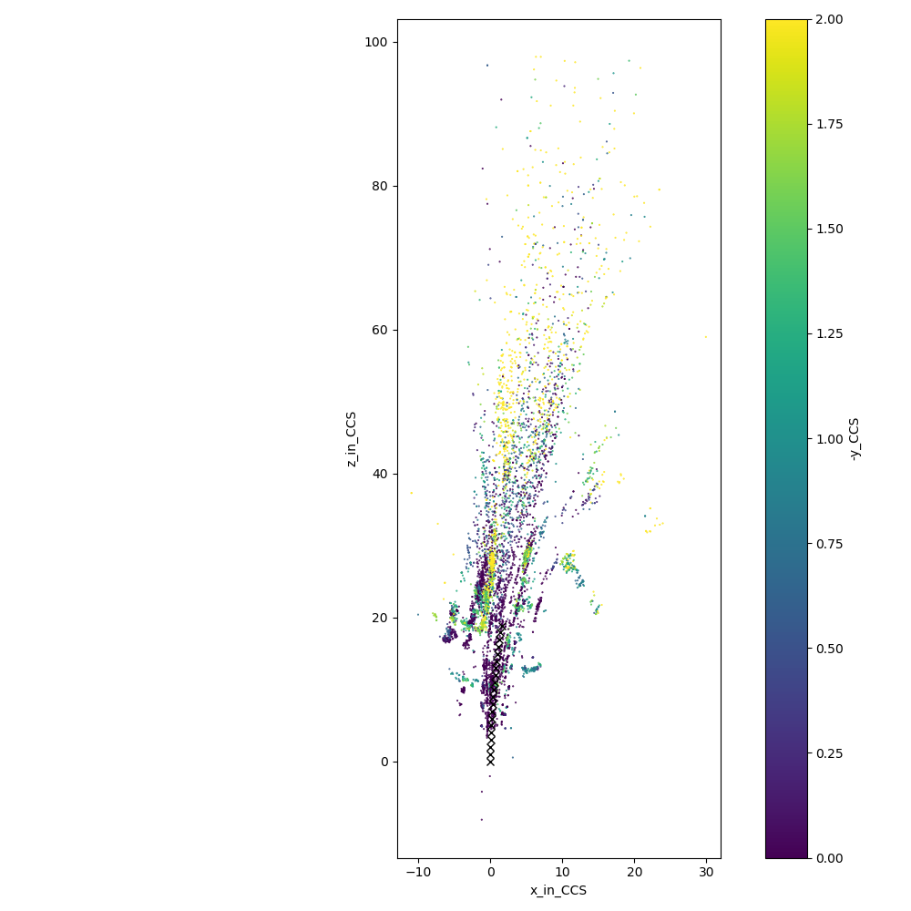
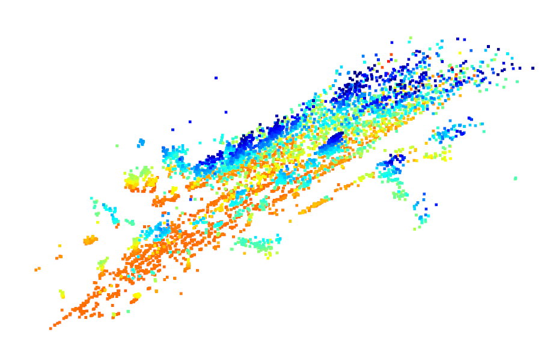

# About

Simple SLAM pipeline using opencv. The example below uses an image sequence from the [KITTI dataset](http://www.cvlibs.net/datasets/kitti/raw_data.php).

# How to install
Create a new conda environment using
`conda env create -f requirements.yaml -n <your_name_for_new_environment>`

# How to run
Simply run `python src/main.py`. This will generate a few things:

- `xyz_in_orgCS.npy` - All 3D points in the coordinate system of the camera in the first keyframe 
- `depthmap_<frame_id>.png` - Plot of projected 3D points onto the keyframes, see video at the very top
- `plot_topview.png` - Plot of 3D points as seen from a top view, see example below

After running `main.py` you can also view the 3D points using the open3D viewer, see screenshot below (color indicates height).

# FAQ

### How many 3D points does the small map above contain?

Points are added with each new keyframe. The map shown above already contains 6832 points.

### How fast is the SLAM pipeline?

On my computer it takes about ~2s per keyframe, so it is rather slow. This demo is NOT meant as any kind of serious SLAM algorithm in terms of performance or accuracy. 

### How can we improve this pipeline?

In terms of accuracy, this algorithm lacks a lot of ideas of even old SLAM algorithms such as [PTAM](http://www.robots.ox.ac.uk/~gk/PTAM/). For example:

- bundle adjustment
- loop closure
- choose keyframes more specifically (now, simply every third frame is used as keyframe)
- track features in between keyframes
- Use more precise optimizations for the estimations, e.g. when calculating the essential matrix

In terms of computational speed, you could...

- deactivate plotting
- perform most of the computation on the GPU instead of the CPU
- parallelize some things
- switch from python to C++ (not sure about benefit, since opencv's function are already in C, or?)